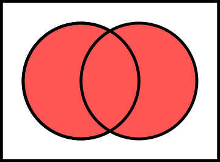
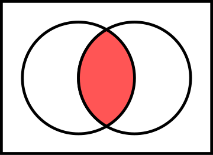

<!-- TOC start (generated with https://github.com/derlin/bitdowntoc) -->

- [Problem Statement](#problem-statement)
- [Solving the inverse problem](#solving-the-inverse-problem)
- [Inclusion Exclusion Principle](#inclusion-exclusion-principle)
- [Variations](#variations)
   * [Variation 1: Counting Sequences with Required Elements](#variation-1-counting-sequences-with-required-elements)
   * [Variation 2: Number of upper-bound integer sums](#variation-2-number-of-upper-bound-integer-sums)
   * [Variation 3: Leetcode Problem Ugly Number III](#variation-3-leetcode-problem-ugly-number-iii)
   * [Other Variations](#other-variations)
- [Conclusion](#conclusion)
- [References and Further Reading](#references-and-further-reading)
- [Appendix](#appendix)

<!-- TOC end -->

<!-- TOC --><a href="#" name="problem-statement"></a>
## Problem Statement

Let's first start with the problem statement:

`Count the number of permutations of digits from 0 to 9 such that the first digit is greater than 1, and the last digit is less than 8.`

<!-- TOC --><a href="#" name="solving-the-inverse-problem"></a>
## Solving the inverse problem

Let's first try to solve for the inverse problem. i.e. finding all permutations where the first digit is greater than 1, OR the last digit is less than 8

If we define `X` and `Y` as follows:
```
X: The set of permutations where the first digit is less than or equal to 1.
Y: The set of permutations where the last digit is greater than or equal to 8.
```

From *venn diagram*:

**`|X ∪ Y|`**
    

**`|X ∩ Y|`**:
    

it follows:

i.e.
```
|X ∪ Y| : Count of permutations with "first digit is less than or equal to 1" OR "last digit is greater than or equal to 8".

|X ∩ Y|: Count of permutations with "first digit is less than or equal to 1" AND "last digit is greater than or equal to 8".
```

```
|X ∪ Y| : Represents all the bad permutations.
This is the solution to the "inverse" problem.

So,
Our answer = All Permutations of [O, 9]  - All Bad permutations
=> answer = All Permutations of [O, 9] - |X ∪ Y|

Since, `|X ∪ Y| = |X| + |Y| - |X ∩ Y|`

Answer = `Total Permutations of [O, 9] - (|X| + |Y| - |X ∩ Y|)`
```

Here is the code:
```python
from math import factorial

def count_permutations_ie():
    total_permutations = factorial(10)
    bad_first_digit = 2 * factorial(9)  # 2 options (0 or 1) for the first digit
    bad_last_digit = 2 * factorial(9)   # 2 options (8 or 9) for the last digit
    bad_first_and_last = 2 * 2 * factorial(8)  # 2 options for first, 2 for last

    bad_permutations = bad_first_digit + bad_last_digit - bad_first_and_last
    good_permutations = total_permutations - bad_permutations

    return good_permutations

print(f"Number of permutations (IE): {count_permutations_ie()}")
```

> This can also be solved via dynamic programming. See section [Appendix](#appendix).
{:.prompt-tip}

<!-- TOC --><a href="#" name="inclusion-exclusion-principle"></a>
## Inclusion Exclusion Principle

What we observed above was basically the `Inclusion Exclusion Principle`.

To find `|X ∪ Y|`, we used  `|X| + |Y| - |X ∩ Y|`.

Here is a more complete definition:

The `Inclusion-Exclusion Principle` is a counting technique that allows us to find the cardinality (size) of the union of multiple sets by considering their individual cardinalities, their intersections, and their complements. The principle states that:

```
|A_1 ∪ A_2 ∪ ... ∪ A_n| = Σ(|A_i|) - Σ(|A_i ∩ A_j|) + Σ(|A_i ∩ A_j ∩ A_k|) - ... + (-1)^(n-1) * |A_1 ∩ A_2 ∩ ... ∩ A_n|
```
In simpler terms, the principle says that to find the cardinality of the union of sets, we need to:

- Add the cardinalities of all the individual sets.
- Subtract the cardinalities of all pairwise intersections of the sets.
- Add the cardinalities of all triple intersections of the sets.
- Subtract the cardinalities of all quadruple intersections of the sets, and so on, alternating the signs.

>This formula might seem intimidating at first, but it becomes more intuitive with examples and practice.
{:.prompt-tip}

<!-- TOC --><a href="#" name="variations"></a>
## Variations

<!-- TOC --><a href="#" name="variation-1-counting-sequences-with-required-elements"></a>
### Variation 1: Counting Sequences with Required Elements
Consider a problem where we need to count the number of sequences of length n consisting of only 0, 1, and 2, such that each number occurs at least once.

We can represent the set of "bad" sequences (those that don't satisfy the constraint) as the union of three sets:

A_0: The set of sequences that don't contain 0.
A_1: The set of sequences that don't contain 1.
A_2: The set of sequences that don't contain 2.
Using the Inclusion-Exclusion Principle, we can find the cardinality of the "bad" sequences as:

```bash
|A_0 ∪ A_1 ∪ A_2| = |A_0| + |A_1| + |A_2| - |A_0 ∩ A_1| - |A_0 ∩ A_2| - |A_1 ∩ A_2| + |A_0 ∩ A_1 ∩ A_2|
```

We can calculate the cardinalities as follows:

```python
def count_sequences(n):
    total_sequences = 3 ** n
    bad_sequences = 3 * (2 ** n) - 3 * (1) + 0
    good_sequences = total_sequences - bad_sequences
    return good_sequences

n = 5
print(f"Number of good sequences of length {n}: {count_sequences(n)}")
```

This code will output the number of sequences of length n that contain all three elements (0, 1, and 2) at least once.

<!-- TOC --><a href="#" name="variation-2-number-of-upper-bound-integer-sums"></a>
### Variation 2: Number of upper-bound integer sums

For `x1 + x2 + x3 + x4 + x5 + x6 = 20`, where `0 <= xi <= 8`, find the number of solutions.

- Let's define the set of `"good"` solutions as the set of all tuples `(x1, x2, x3, x4, x5, x6)` that **satisfy** the equation `x1 + x2 + x3 + x4 + x5 + x6 = 20` and the constraint `0 ≤ xi ≤ 8` for **all i**.
- Also, let's define the set of `"bad"` solutions as the set of tuples that **violate** the constraint `0 ≤ xi ≤ 8` for **at least one value of i**.

Now, we can use the `Inclusion-Exclusion Principle` to count the number of `"bad"` solutions and then subtract it from the total number of solutions to get the count of `"good"` solutions.

Here is the code:

```python
from functools import lru_cache

@lru_cache(maxsize=None)
def count_solutions(target, num_vars, lower_bound=0, upper_bound=8):
    """
    Count the number of solutions to the equation x1 + x2 + ... + xn = target,
    where lower_bound <= xi <= upper_bound for all i.
    """
    if num_vars == 1:
        return 1 if lower_bound <= target <= upper_bound else 0

    solutions = 0
    for x in range(lower_bound, upper_bound + 1):
        remaining_target = target - x
        solutions += count_solutions(remaining_target, num_vars - 1, lower_bound, upper_bound)

    return solutions

def count_solutions_with_inclusion_exclusion(target, num_vars, lower_bound=0, upper_bound=8):
    total_solutions = count_solutions(target, num_vars, 0, upper_bound)
    bad_solutions = 0

    for k in range(1, num_vars + 1):
        invalid_values = [0] * k + [-1] * (num_vars - k)
        bad_solutions += (-1) ** k * count_solutions(target, num_vars, lower_bound, upper_bound - 1, invalid_values)

    return total_solutions - bad_solutions

# Example usage
target = 20
num_vars = 6
print(f"Number of solutions: {count_solutions_with_inclusion_exclusion(target, num_vars)}")
```


<!-- TOC --><a href="#" name="variation-3-leetcode-problem-ugly-number-iii"></a>
### Variation 3: Leetcode Problem [Ugly Number III](https://leetcode.com/problems/ugly-number-iii/description/){:target="_blank"}

>This is a bit advanced. Here, the `Inclusion Exclusion Principle` helps us break down the problem so that we can apply binary search, and find the solution.
{:.prompt-warning}

An `ugly number` is a positive integer that is divisible by `a`, `b`, **OR** `c`.

Given four integers `n`, `a`, `b`, and `c`, return the `nth ugly number`.

Basically, we can find count of such ugly numbers from `1...N` by doing this:

```bash
+ count of numbers from 1..n which are divisible by a
+ count of numbers from 1..n which are divisible by b
+ count of numbers from 1..n which are divisible by c
- count of numbers from 1..n which are divisible by a AND b
- count of numbers from 1..n which are divisible by b AND c
- count of numbers from 1..n which are divisible by a AND c
+ count of numbers from 1..n which are divisible by a,b AND c
```

Let's call this ***`f(K)`***. Now the task is to find out the ***least K such that f(K) >= N.***
We can do a ***binary search***.

```python
class Solution:
    def gcd(self, a, b):
        if b == 0:
            return a
        return self.gcd(b, a%b)

    def lcm(self, a, b):
        return (a * b) // self.gcd(a,b)

    def uglyCountFrom1toN(self, a, b, c, n):
        return n // a + n // b + n // c - n // self.lcm(a,b) - n // self.lcm(b,c) - n // self.lcm(a,c) + n // self.lcm(a,self.lcm(b,c))

    def nthUglyNumber(self, n: int, a: int, b: int, c: int) -> int:
        lo = min(a,b,c)
        hi = max(a*b*c, 2*pow(10,9))
        while lo < hi:
            mid = lo + (hi-lo)//2
            count = self.uglyCountFrom1toN(a,b,c,mid)
            # print(lo, hi, mid, count, n)
            if count < n:
                lo = mid+1
            else:
                hi = mid
            # print(lo, hi)
        return lo

```

<!-- TOC --><a href="#" name="other-variations"></a>
### Other Variations
You can find several other variations in this [wonderful detailed article](https://cp-algorithms.com/combinatorics/inclusion-exclusion.html#the-formulation-using-venn-diagrams){:target="_blank"}.


<!-- TOC --><a href="#" name="conclusion"></a>
## Conclusion
The Inclusion-Exclusion Principle is a powerful combinatorics technique that can be applied to a wide range of counting problems. While the principle's formula might seem daunting at first, its systematic approach can simplify complex counting scenarios by breaking them down into manageable parts.

By understanding the Inclusion-Exclusion Principle and practicing its application, developers can enhance their problem-solving skills and tackle intricate counting problems more effectively. Whether you're working on algorithms, probability theory, or combinatorics-related challenges, mastering this technique can be a valuable asset in your programming toolbox.

<!-- TOC --><a href="#" name="references-and-further-reading"></a>
## References and Further Reading
- [https://cp-algorithms.com/combinatorics/inclusion-exclusion.html#the-formulation-using-venn-diagrams](https://cp-algorithms.com/combinatorics/inclusion-exclusion.html#the-formulation-using-venn-diagrams){:target="_blank"}
- [https://codeforces.com/topic/65035](https://codeforces.com/topic/65035){:target="_blank"}
- [https://leetcode.com/problems/ugly-number-iii/discuss/387539/cpp-Binary-Search-with-picture-and-Binary-Search-Template](https://leetcode.com/problems/ugly-number-iii/discuss/387539/cpp-Binary-Search-with-picture-and-Binary-Search-Template){:target="_blank"}


<!-- TOC --><a href="#" name="appendix"></a>
## Appendix

Can this be solved using Dynamic Programming ?
Yes.
Let's define `dp[i][j]` that stores the count of permutations of length i where the first digit is j.

```python
from math import factorial
def count_permutations_dp(n):
    dp = [[0] * 10 for _ in range(n + 1)]

    # Base case: For permutations of length 1, there's 1 permutation for each digit
    for j in range(10):
        dp[1][j] = 1

    # Fill the dp table
    for i in range(2, n + 1):
        for j in range(10):
            if j > 1:  # Include permutations where the first digit is greater than 1
                dp[i][j] = 9 * dp[i - 1][j] + factorial(9)
            else:
                dp[i][j] = 8 * dp[i - 1][j]

    # Calculate the desired result
    result = sum(dp[n][j] for j in range(2, 8))
    return result

print(f"Number of permutations (DP): {count_permutations_dp(10)}")
```
Time complexity: `O(n * 10)`
Space complexity:`O(n * 10)`, where n is the number of digits (10 in this case).