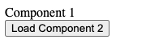
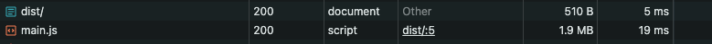
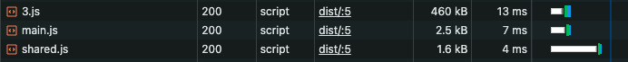
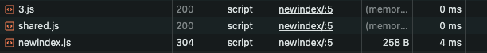
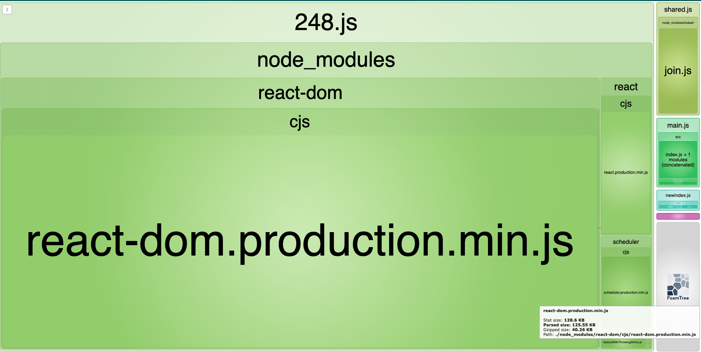

<!-- TOC start (generated with https://github.com/derlin/bitdowntoc) -->

- [Introduction](#introduction)
- [Setup](#setup)
- [Starting State](#starting-state)
- [Tree Shaking](#tree-shaking)
- [Minification](#minification)
- [Use only what is needed](#use-only-what-is-needed)
- [Code Splitting ](#code-splitting)
- [Lazy loading](#lazy-loading)
- [Production mode](#production-mode)
- [Compression](#compression)
- [Other options](#other-options)
- [Bundle analyzer](#bundle-analyzer)
- [Conclusion](#conclusion)
- [References](#references)

<!-- TOC end -->


<!-- TOC --><a href="#" name="introduction"></a>
## Introduction
In modern web development, all webpage assets like `html`, `css`, `js`, etc are bundled together into a smaller set of assets. This helps in reducing network calls from the client/user agent, and gives a much smaller file to download. This in turn gives a fast and efficient user experience, which is what we all want. 

There are various tools available that manage the size of bundled assets. We are going to use the example of a popular and widely used bundler named [Webpack](https://webpack.js.org/){:target="_blank"}, and practically look at many of the optimization techniques it offers.


<!-- TOC --><a href="#" name="setup"></a>
## Setup

Let's start with a basic node + react setup. It's okay if you don't have expertise in this. Ensure you have `node` and `npm`  and `npx` installed.

We are using `webpack5`, but the concepts are more or less transferable across versions with minor modifications.

My `node` and `npm` version details:
```bash
webpack-optimization-demo % node --version
v20.11.1
webpack-optimization-demo % npm --version
10.2.4
```

> You can get the initial code from [repo](https://github.com/viv1/blog-code-examples/tree/main/webpack-optimization-demo). Follow these steps:
{: .prompt-tip}

- `git clone git@github.com:viv1/blog-code-examples.git` 
- `git checkout dab817ec0a502adff4c82070c58ee36bb79e7bc0` 
- `cd blog-code-examples/webpack-optimization-demo` , then run `npm install .`. 
- You can go directly to section [Starting State](#starting-state).

If you would like to do it from scratch, follow along:

- Let's initiate a node project:

```bash
mkdir webpack-optimization-demo
cd webpack-optimization-demo
npm init -y
```

- Install libraries and dependencies:

```bash
npm install --save-dev webpack webpack-cli webpack-dev-server style-loader css-loader babel-loader @babel/core @babel/preset-env @babel/preset-react html-webpack-plugin
npm install --save prop-types process lodash react react-dom webpack
```

- Create the following files in this directory structure:

This is a simple single page app with 2 components. 
`App.js` is cretaed using `Component1` and a `Component2`. `Component1`  and `Component2` are simple text displays. `Component1` is shown by default with a button.
When button is clicked, it displays `Component2`.
`unUsedComponent` is not really used anywhere.

```bash
- src
    - components
        - Component1.js
        - Component2.js
        - unUsedComponent.js
    - App.js
    - index.html
    - index.js
- webpack.config.js
- package.json
- package.lock.json

```

```js
import React from 'react';
import PropTypes from 'prop-types';
import _ from 'lodash';

const Component1 = () => {
  let x = _.join(['C', 'o', 'm', 'p', 'o', 'n', 'e', 'n', 't', ' 1'], '');
  return <div>{x}</div>;
}

Component1.propTypes = {
  title: PropTypes.string,
  description: PropTypes.string,
  count: PropTypes.number,
};

export default Component1;
```
{: file='Component1.js'}

```js
import React from 'react';

const Component2 = () => {
  return <div>Component 2</div>;
}

export default Component2;
```
{: file='Component2.js'}

```js
const unUsedComponent = () => {
    console.log("Using-unUsedComponent");
    return (
    <div>unUsedComponent</div>
    )
}
export default unUsedComponent;
```
{: file='unUsedComponent.js'}

```html
<!DOCTYPE html>
<html>
  <head>
    <meta charset="UTF-8" />
    <title>Webpack Optimization</title>
  </head>
  <body>
    <div id="root"></div>
  </body>
</html>
```
{: file='index.html'}

```js
import React, { useState } from 'react';
import Component1 from './components/Component1';
import Component2 from './components/Component2';
import unUsedComponent from './components/UnUsedComponent';

const App = () => {
  const [showComponent2, setShowComponent2] = useState(false);

  const handleClick = () => {
    setShowComponent2(true);
  }

  return (
    <div>
      <Component1 />
      <button onClick={handleClick}>Load Component 2</button>
      {showComponent2 && <React.Suspense fallback={<div>Loading...</div>}>
        <Component2 />
      </React.Suspense>}
    </div>
  );
}

export default App;
```
{: file='App.js'}

```js
import React from 'react';
import ReactDOM from 'react-dom';
import App from './App';

ReactDOM.render(<App />, document.getElementById('root'));
```
{: file='index.js'}

```js
const path = require('path');
const HtmlWebpackPlugin = require('html-webpack-plugin');
const webpack = require('webpack');

module.exports = {
  mode: 'none',
  entry: {
    main: { import: "./src/index.js" }
  },
  module: {
    rules: [
      {
        test: /\.(js|jsx)$/,
        exclude: /node_modules/,
        use: {
          loader: 'babel-loader',
          options: {
            presets: ['@babel/preset-env', '@babel/preset-react']
          }
        }
      }
    ]
  },
  plugins: [
    new HtmlWebpackPlugin({
      filename: "index.html",
      template: "./src/index.html",
    }),
    // fix "process is not defined" error:
    new webpack.ProvidePlugin({
      process: 'process/browser',
    }),
  ]
};
```
{: file='webpack.config.js'}

<!-- TOC --><a href="#" name="starting-state"></a>
## Starting State
Let's first build the assets and see if our starting set is all good.

Run `npx webpack` to build the assets:
```
webpack-optimization-demo % npx webpack
asset main.js 1.8 MiB [compared for emit] (name: main)
asset index.html 201 bytes [compared for emit]
runtime modules 1.25 KiB 6 modules
modules by path ./node_modules/ 1.78 MiB
  modules by path ./node_modules/prop-types/ 28.6 KiB 6 modules
  modules by path ./node_modules/react/ 92.5 KiB 3 modules
  modules by path ./node_modules/react-dom/ 1.11 MiB 3 modules
  modules by path ./node_modules/scheduler/ 21.4 KiB 3 modules
  modules by path ./node_modules/react-is/ 9.5 KiB 3 modules
  + 3 modules
modules by path ./src/ 3.27 KiB
  modules by path ./src/components/*.js 710 bytes
    ./src/components/Component1.js 342 bytes [built] [code generated]
    + 2 modules
  modules by path ./src/*.js 2.58 KiB
    ./src/index.js 181 bytes [built] [code generated]
    ./src/App.js 2.4 KiB [built] [code generated]
webpack 5.91.0 compiled successfully in 743 ms
```

Notice the bundle size as `1.8MiB` (Your bundle sizes might be slightly different)

Let's also see how our page looks:

Run `npx http-server -p 8000`. Now, open your web browser, and open developer tools. Go to Network tab.

Now load `http://localhost:8000/dist` on your web browser. Your page should look like this:



Your network tab:


If we click on button for `Loading Component 2`, we see that no new network call was made even though `Component 2` was loaded. 

Now that our starting point is all good, we are going to look into how we can optimize this code.

>At any point, feel free to complete delete the `dist` folder since it gets generated automatically when `npx webpack` is run.
{:.prompt-tip}

<!-- TOC --><a href="#" name="tree-shaking"></a>
## Tree Shaking

Let's start with [Tree Shaking]{https://webpack.js.org/guides/tree-shaking/}{:target="_blank"}
It's a method to remove any unused modules.

`unUsedComponent` is not really used in the display. However, it is still present in the code:

If we go to dist/main.js. Search for `Using-unUsedComponent`, we see that it is present.

Let's start fixing this:

- Add this in webpack.config.js under `modules.exports` and then run `npx webpack`:

```
optimization: {
    usedExports: true,
  },
```

```
webpack-optimization-demo2 % npx webpack
asset main.js 1.79 MiB [emitted] (name: main)
asset index.html 201 bytes [compared for emit]
runtime modules 1010 bytes 5 modules
modules by path ./node_modules/ 1.78 MiB
  modules by path ./node_modules/prop-types/ 28.6 KiB 6 modules
  modules by path ./node_modules/react/ 92.5 KiB 3 modules
  modules by path ./node_modules/react-dom/ 1.11 MiB 3 modules
  modules by path ./node_modules/scheduler/ 21.4 KiB 3 modules
  modules by path ./node_modules/react-is/ 9.5 KiB 3 modules
  + 3 modules
modules by path ./src/ 3.27 KiB
  modules by path ./src/components/*.js 710 bytes
    ./src/components/Component1.js 342 bytes [built] [code generated]
    + 2 modules
  modules by path ./src/*.js 2.58 KiB
    ./src/index.js 181 bytes [built] [code generated]
    ./src/App.js 2.4 KiB [built] [code generated]
webpack 5.91.0 compiled successfully in 735 ms
```

Not much change in file size. However, if we go to dist/main.js. Search for `unUsedComponent`, we see it is **NOT** present.

Just like that, we have removed an unused component we created.  


<!-- TOC --><a href="#" name="minification"></a>
## Minification
Next, we will do some minification. Minification is a process to reduce the total size of file contents by removing characters and parts which are deemed useless for machines. 
For example, spaces in codes are simply a way for them to be readable by humans. However, from machine point of view,  these are harmless. Minification helps remove these additional spaces among other things. Let's use an external plugin to help minify further.

We will install a minimizer plugin:
`npm install --save-dev terser-webpack-plugin`

Now, add this in webpack.config.js under `modules.exports` and then run `npx webpack`:

```
const TerserPlugin = require('terser-webpack-plugin');
module.exports = {
  // ... other config
  optimization: {
    // ...
    minimize: true,
    minimizer: [new TerserPlugin()],
  },
}
```

```bash
webpack-optimization-demo % npx webpack
asset main.js 520 KiB [emitted] [minimized] (name: main) 1 related asset
asset index.html 201 bytes [compared for emit]
runtime modules 1010 bytes 5 modules
modules by path ./node_modules/ 1.78 MiB
  modules by path ./node_modules/prop-types/ 28.6 KiB 6 modules
  modules by path ./node_modules/react/ 92.5 KiB 3 modules
  modules by path ./node_modules/react-dom/ 1.11 MiB 3 modules
  modules by path ./node_modules/scheduler/ 21.4 KiB 3 modules
  modules by path ./node_modules/react-is/ 9.5 KiB 3 modules
  + 3 modules
modules by path ./src/ 3.27 KiB
  modules by path ./src/components/*.js 710 bytes
    ./src/components/Component1.js 342 bytes [built] [code generated]
    + 2 modules
  modules by path ./src/*.js 2.58 KiB
    ./src/index.js 181 bytes [built] [code generated]
    ./src/App.js 2.4 KiB [built] [code generated]
webpack 5.91.0 compiled successfully in 3011 ms
```

Notice the reduction in file size. From `1.79MiB` to `520KiB`. Around **`70% savings`** in size.

<!-- TOC --><a href="#" name="use-only-what-is-needed"></a>
## Use only what is needed

Notice that in `Component1.js`, we only use join but we are instead importing the whole `lodash` library.
`lodash` has split each function in their own library file, so we can just download `lodash/join` instead of the whole things.

Make the following code change in `Component1.js`:

```
// ...
import join from 'lodash/join';
// ...
let x = join(['C', 'o', 'm', 'p', 'o', 'n', 'e', 'n', 't', ' 1'], '');
```
{: file='Component1.js'}

And then run `npx webpack`:

```
webpack-optimization-demo % npx webpack
asset main.js 451 KiB [emitted] [minimized] (name: main) 1 related asset
asset index.html 201 bytes [compared for emit]
runtime modules 786 bytes 4 modules
modules by path ./node_modules/ 1.27 MiB
  modules by path ./node_modules/prop-types/ 28.6 KiB 6 modules
  modules by path ./node_modules/react/ 92.5 KiB 3 modules
  modules by path ./node_modules/react-dom/ 1.11 MiB 3 modules
  modules by path ./node_modules/scheduler/ 21.4 KiB 3 modules
  modules by path ./node_modules/react-is/ 9.5 KiB 3 modules
  + 3 modules
modules by path ./src/ 3.34 KiB
  modules by path ./src/components/*.js 779 bytes
    ./src/components/Component1.js 411 bytes [built] [code generated]
    + 2 modules
  modules by path ./src/*.js 2.58 KiB
    ./src/index.js 181 bytes [built] [code generated]
    ./src/App.js 2.4 KiB [built] [code generated]
webpack 5.91.0 compiled successfully in 2543 ms
```

Notice the further reduction is asset size.

<!-- TOC --><a href="#" name="code-splitting"></a>
## Code Splitting 
[Code Splitting](https://webpack.js.org/guides/code-splitting/){:target="_blank"} is a way to split the bundled asset into multiple bundled assets, which can be loaded on demand, or in parallel. 
We will see how to code split here, and take advantage of it in this and the next section.

To demonstrate this better, let's create a new page which only loads `Component1`. Remember that `Component1` uses `lodash/join`.

Create `NewApp.js` inside `src`, which only loads `Component1`:
```js
import React from 'react';
import Component1 from './components/Component1';

const AppNew = () => {
  return (
    <div>
      <Component1 />
    </div>
  );
}

export default AppNew;
```
{: file='NewApp.js'}

Create `newindex.js` inside `src`:

```js
import React from 'react';
import ReactDOM from 'react-dom';
import AppNew from './AppNew';

ReactDOM.render(<AppNew />, document.getElementById('root'));
```
{: file='newindex.js'}


Let's now update `webpack.config.js` to the following:

```js
const path = require('path');
const HtmlWebpackPlugin = require('html-webpack-plugin');
const TerserPlugin = require('terser-webpack-plugin');
const webpack = require('webpack');

module.exports = {
  mode: 'none',
  entry: {
    main: { import: "./src/index.js", dependOn: "shared" },
    newindex: { import: "./src/newindex.js", dependOn: "shared" },
    shared: "lodash/join",
  },
  output: {
    filename: '[name].js',
    path: path.resolve(__dirname, 'dist'),
  },
  module: {
    rules: [
      {
        test: /\.(js|jsx)$/,
        exclude: /node_modules/,
        use: {
          loader: 'babel-loader',
          options: {
            presets: ['@babel/preset-env', '@babel/preset-react']
          }
        }
      }
    ]
  },
  plugins: [
    new HtmlWebpackPlugin({
      filename: "index.html",
      template: "./src/index.html",
      chunks: ["main", "shared"],
    }),
    new HtmlWebpackPlugin({
      filename: "newindex/index.html",
      template: "./src/index.html",
      chunks: ["newindex", "shared"],
    }),
    // fix "process is not defined" error:
    new webpack.ProvidePlugin({
      process: 'process/browser',
    }),
  ],
  optimization: {
    usedExports: true,
    minimize: true,
    minimizer: [new TerserPlugin()],
    splitChunks: {
      chunks: 'all',
    },
  },
};
```
{: file='webpack.config.js'}

Here, we are doing the following things:
1. Modified `entry` to have 2 new values, `main` & `newindex`
2. `lodash/join` is used in both pages, so we have taken out `lodash/join` into a new common `shared` asset 
3. `output` specifies how would we name our new assets.
4. Add `HtmlWebpackPlugin` to be able to load `newindex` page
5. Added [`splitChunks`](https://webpack.js.org/guides/code-splitting/#splitchunksplugin) in `optimization`

Let's run `npx webpack` again:

```bash
webpack-optimization-demo % npx webpack
assets by path *.js 453 KiB
  asset 3.js 449 KiB [compared for emit] [minimized] (id hint: vendors) 1 related asset
  asset main.js 2.14 KiB [compared for emit] [minimized] (name: main)
  asset shared.js 1.25 KiB [compared for emit] [minimized] (name: shared)
  asset newindex.js 736 bytes [compared for emit] [minimized] (name: newindex)
asset newindex/index.html 287 bytes [compared for emit]
asset index.html 274 bytes [compared for emit]
Entrypoint main 451 KiB = 3.js 449 KiB main.js 2.14 KiB
Entrypoint newindex 449 KiB = 3.js 449 KiB newindex.js 736 bytes
Entrypoint shared 1.25 KiB = shared.js
runtime modules 3.18 KiB 6 modules
modules by path ./node_modules/ 1.27 MiB
  modules by path ./node_modules/prop-types/ 28.6 KiB 6 modules
  modules by path ./node_modules/react/ 92.5 KiB 3 modules
  modules by path ./node_modules/react-dom/ 1.11 MiB 3 modules
  modules by path ./node_modules/scheduler/ 21.4 KiB 3 modules
  modules by path ./node_modules/react-is/ 9.5 KiB 3 modules
  + 3 modules
modules by path ./src/ 3.76 KiB
  modules by path ./src/*.js 3 KiB
    ./src/newindex.js 190 bytes [built] [code generated]
    + 3 modules
  modules by path ./src/components/*.js 779 bytes
    ./src/components/Component1.js 411 bytes [built] [code generated]
    + 2 modules
webpack 5.91.0 compiled successfully in 2620 ms
```

Notice how multiple different asset files are getting created, including one for `shared.js` which only contains `lodash/join`. We can find these files inside the `dist/` folder.

At this point, let's run the server again and see how it all looks: `npx http-server -p 8000`:

If we open [`https://localhost:8000/dist`](https://localhost:8000/dist){:target="_blank"}, we see that `newindex.js` is not loaded:



If we open [`https://localhost:8000/dist/newindex`](https://localhost:8000/dist/newindex){:target="_blank"}, we see that `main.js` is not loaded:




<!-- TOC --><a href="#" name="lazy-loading"></a>
## Lazy loading

[Lazy loading](https://webpack.js.org/guides/lazy-loading/) simply means that loading of an asset should happen only on demand.

In our case, we have seen that `Component2` gets shown to user only when the button has clicked. However, it is loaded upfront. We are goin to load this only on demand.

Update `App.js` with following 2 changes:

```
import React, { useState, lazy } from 'react';
// ...
const Component2 = lazy(() => import('./components/Component2'));
// ...
```
{: file='App.js'}

Run `npx webpack`, we see a new asset (`4.js` in my case, it might be named differently for you) is created in the `dist`:

```bash
webpack-optimization-demo % npx webpack
assets by path *.js 455 KiB
  asset 3.js 449 KiB [compared for emit] [minimized] (id hint: vendors) 1 related asset
  asset shared.js 3.2 KiB [compared for emit] [minimized] (name: shared)
  asset main.js 2.06 KiB [compared for emit] [minimized] (name: main)
  asset newindex.js 736 bytes [compared for emit] [minimized] (name: newindex)
  asset 4.js 254 bytes [compared for emit] [minimized]
asset newindex/index.html 287 bytes [compared for emit]
asset index.html 274 bytes [compared for emit]
Entrypoint main 451 KiB = 3.js 449 KiB main.js 2.06 KiB
Entrypoint newindex 449 KiB = 3.js 449 KiB newindex.js 736 bytes
Entrypoint shared 3.2 KiB = shared.js
runtime modules 8.12 KiB 12 modules
modules by path ./node_modules/ 1.27 MiB
  modules by path ./node_modules/prop-types/ 28.6 KiB 6 modules
  modules by path ./node_modules/react/ 92.5 KiB 3 modules
  modules by path ./node_modules/react-dom/ 1.11 MiB 3 modules
  modules by path ./node_modules/scheduler/ 21.4 KiB 3 modules
  modules by path ./node_modules/react-is/ 9.5 KiB 3 modules
  + 3 modules
modules by path ./src/ 3.8 KiB
  modules by path ./src/*.js 3.04 KiB
    ./src/newindex.js 190 bytes [built] [code generated]
    + 3 modules
  modules by path ./src/components/*.js 779 bytes
    ./src/components/Component1.js 411 bytes [built] [code generated]
    + 2 modules
webpack 5.91.0 compiled successfully in 2529 ms
```

What is this asset ? Le's open it (Find it in `dist/4.js`).
We see that `4.js` contains our `Component2` code. 

Let's now run `npx http-server -p 8000`, open `Developer Tools` and go to `Network Tab` and open `https://localhost:8000/dist`

We see that `4.js` is not yet loaded.
Click on the button `Load Component 2` and notice that  `4.js` gets loaded now.

There you have it, Lazy (On-demand) Loading.

<!-- TOC --><a href="#" name="production-mode"></a>
## Production mode

We can provide different modes in the webpack config. We are currently running with `none` mode. We can specify `development` and `production` mode.
In `development` mode, the purpose is ease of development. In `production` mode, the purpose is to give small, fast, optimized assets.

Let's change the mode in:

```js
// ...
mode: 'production',
// ...
```
{: file='webpack.config.js'}

Run `npx webpack` and notice how the asset size is reduced in size by a huge number.

```bash
webpack-optimization-demo % npx webpack
assets by path *.js 143 KiB
  asset 248.js 137 KiB [emitted] [minimized] (id hint: vendors) 1 related asset
  asset shared.js 3.13 KiB [emitted] [minimized] (name: shared)
  asset main.js 1.94 KiB [emitted] [minimized] (name: main)
  asset newindex.js 644 bytes [emitted] [minimized] (name: newindex)
  asset 860.js 248 bytes [emitted] [minimized]
asset newindex/index.html 282 bytes [emitted]
asset index.html 269 bytes [emitted]
Entrypoint main 139 KiB = 248.js 137 KiB main.js 1.94 KiB
Entrypoint newindex 137 KiB = 248.js 137 KiB newindex.js 644 bytes
Entrypoint shared 3.13 KiB = shared.js
runtime modules 8 KiB 11 modules
orphan modules 2.88 KiB [orphan] 3 modules
cacheable modules 148 KiB
  modules by path ./node_modules/ 144 KiB
    modules by path ./node_modules/prop-types/ 2.6 KiB 3 modules
    modules by path ./node_modules/react/ 6.95 KiB 2 modules
    modules by path ./node_modules/react-dom/ 130 KiB 2 modules
    modules by path ./node_modules/scheduler/ 4.33 KiB 2 modules
    + 1 module
  modules by path ./src/ 3.61 KiB
    modules by path ./src/*.js 3.04 KiB 2 modules
    modules by path ./src/components/*.js 579 bytes
      ./src/components/Component1.js 411 bytes [built] [code generated]
      ./src/components/Component2.js 168 bytes [built] [code generated]
webpack 5.91.0 compiled successfully in 1664 ms
```

<!-- TOC --><a href="#" name="compression"></a>
## Compression

We can also compress the files further to ensure a smaller asset is transferred over the network.

Run `npm install compression-webpack-plugin --save-dev`, and then run `npx webpack`.

```bash
webpack-optimization-demo % npx webpack
assets by path *.js 143 KiB
  assets by status 5.7 KiB [emitted]
    asset shared.js 3.13 KiB [emitted] [minimized] (name: shared) 1 related asset
    asset main.js 1.94 KiB [emitted] [minimized] (name: main) 1 related asset
    asset newindex.js 644 bytes [emitted] [minimized] (name: newindex) 1 related asset
  assets by status 137 KiB [compared for emit]
    asset 248.js 137 KiB [compared for emit] [minimized] (id hint: vendors) 2 related assets
    asset 860.js 248 bytes [compared for emit] [minimized] 1 related asset
asset newindex/index.html 282 bytes [emitted] 1 related asset
asset index.html 269 bytes [emitted] 1 related asset
Entrypoint main 139 KiB = 248.js 137 KiB main.js 1.94 KiB
Entrypoint newindex 137 KiB = 248.js 137 KiB newindex.js 644 bytes
Entrypoint shared 3.13 KiB = shared.js
runtime modules 8 KiB 11 modules
orphan modules 2.88 KiB [orphan] 3 modules
cacheable modules 148 KiB
  modules by path ./node_modules/ 144 KiB
    modules by path ./node_modules/prop-types/ 2.6 KiB 3 modules
    modules by path ./node_modules/react/ 6.95 KiB 2 modules
    modules by path ./node_modules/react-dom/ 130 KiB 2 modules
    modules by path ./node_modules/scheduler/ 4.33 KiB 2 modules
    + 1 module
  modules by path ./src/ 3.61 KiB
    modules by path ./src/*.js 3.04 KiB 2 modules
    modules by path ./src/components/*.js 579 bytes
      ./src/components/Component1.js 411 bytes [built] [code generated]
      ./src/components/Component2.js 168 bytes [built] [code generated]
webpack 5.91.0 compiled successfully in 1656 ms
```
There is no difference in this small example. But the difference can be more significant in larger projects. (It's also possible the compression done in the production mode is comparable in this case, so does not make any difference here).

<!-- TOC --><a href="#" name="other-options"></a>
## Other options

There are still many other steps we can take like [External Dependency](https://webpack.js.org/configuration/externals/){:target="_blank"} where we loaded common large dependencies during run-time from CDN, [Purge Unsued CSS](https://purgecss.com/plugins/webpack.html){:target="_blank"}, [Module Concatenation](https://webpack.js.org/plugins/module-concatenation-plugin/){:target="_blank"} and many more, depending on our specific needs. I will not go into it for the sake of keeping this article consumeable.


<!-- TOC --><a href="#" name="bundle-analyzer"></a>
## Bundle analyzer
I will however mention one very useful plugin [Webpack Bundle Analyzer](https://www.npmjs.com/package/webpack-bundle-analyzer){:target="_blank"}. It graphically helps us visualize which modules are taking how much space and where we should look to optimize. It's also interactive.

```bash
npm install --save-dev webpack-bundle-analyzer
```

Update the `webpack.config.js`:

```js
// ...
const BundleAnalyzerPlugin = require('webpack-bundle-analyzer').BundleAnalyzerPlugin;
// ...
module.exports = {
    // ...
  plugins: [
    // ...
    new BundleAnalyzerPlugin(),
  ],
  // ...
}
```
{: file='webpack.config.js'}

Run `npx webpack` and then open `http://localhost:8888/` and we should see something like this:




<!-- TOC --><a href="#" name="conclusion"></a>
## Conclusion
Optimizing the bundle size of any web application is essential for ensuring a seamless and performant user experience. By leveraging the power of webpack and its optimization techniques, we can significantly reduce the amount of data transferred over the network, leading to faster load times and improved overall performance. Continuously monitoring and refining the webpack configuration will help in maintaining a high-performing and responsive application over time.


<!-- TOC --><a href="#" name="references"></a>
## References
- [Webpack](https://webpack.js.org/){:target="_blank"}
- [Tree Shaking](https://webpack.js.org/guides/tree-shaking/){:target="_blank"}
- [Code Splitting](https://webpack.js.org/guides/code-splitting/){:target="_blank"}
- [External Dependency](https://webpack.js.org/configuration/externals/){:target="_blank"}
- [Purge CSS](https://purgecss.com/plugins/webpack.html){:target="_blank"}
- [Module Concatenation](https://webpack.js.org/plugins/module-concatenation-plugin/){:target="_blank"}
- [Webpack Bundle Analyzer](https://www.npmjs.com/package/webpack-bundle-analyzer){:target="_blank"}