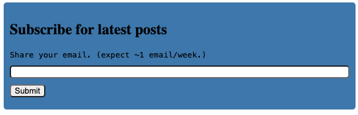

<!-- TOC start (generated with https://github.com/derlin/bitdowntoc) -->
- [Introduction](#introduction)
- [My Requirements and Thinking process](#my-requirements-and-thinking-process)
- [Steps to Setup](#steps-to-setup)
- [Future and Thoughts](#future-and-thoughts)
- [References](#references)
<!-- TOC end -->


<!-- TOC --><a href="#" name="introduction"></a>
## Introduction

Recently, I have received a few requests over email or in person to check for email subscriptions so that they could be informed about new posts. While I do support [`RSS feed`](https://wewake.dev/feed.xml){:target="_blank"}, which is a very convenient way to get notified when new posts come up, it seems it's a preference thing and many prefer email over rss. So, I decided to quickly add something for it so that I can support both, and readers can decide as they wish.


<!-- TOC --><a href="#" name="my-requirements-and-thinking-process"></a>
## My Requirements and Thinking process

So, my requirements were these:
- $0 cost
- Practically unlmited submissions (while I don't see this breaching anytime in the near future, but I don't want to replace the solution when that actually happens)
- Basic Protection against DDOS
- CAPTCHA support

All options that I saw had some or other kind of limitations. Either there are limited submissions per month (netlify, typeform, etc), or, the form provided has a watermark/company logo that cannot be removed (youform) in the free tier. But, for a blog with 0 revenue, I did not want to spend any dime on it, nor use a watermarked item that took just too much of my screen space.

But all I need is a simple form to submit email and store it in a record somewhere. So, the programmer in me decided to create my own solution. How ?

Well, most cloud service providers have always free tier for a compute/VM instance. I could create a simple server thats stores it in a DB. I would still need to add a reverse proxy and some basic protection against attacks. So, this was definitely doable but not a direct solution for such a simple thing. I need more of a managed solution.

So, naturally the next thought is using serverless solution. Most cloud providers give free serverless functions with high enough free tier capacity. I decided to explore these. After looking at the pricing tier and features, I decided to go with Cloudflare since it gave me everything I need; from 0 cost to practically unlimited usage, free managed DB, free managed serverless function, protection against DDOS, CAPTCHA, [all for free for my intended usage](https://www.cloudflare.com/plans/){:target="_blank"}, at one place. I also have been wanting to explore Cloudflare for a while, so this was also a pushing factor.

More precisely, we are using [`cloudflare workers`](https://developers.cloudflare.com/workers/){:target="_blank"}.

This is how it looks like:




<!-- TOC --><a href="#" name="steps-to-setup"></a>
## Steps to Setup

First we need to signup for [cloudflare](https://www.cloudflare.com/){:target="_blank"}.

We also need `node`, `npm` and `npx`. We will do all the tasks through CLI. My versions:

```bash
% node --version
v20.11.1
% npm --version
10.2.4
% npx --version
10.2.4
```


- Create initial directory and install [`wrangler`](https://developers.cloudflare.com/workers/wrangler/){:target="_blank"}. `wrangler` is the CLI tool for interacting with cloudflare.

```bash
mkdir newsletter-functions-cloudflare
touch package.json
npm install wrangler --save-dev
```

Check that it is installed:

```bash
% npx wrangler --version
 ⛅️ wrangler 3.53.1
-------------------
```

- Initialize a cloudflare worker project. Say we want to name it: `wewake-newsletter`

```bash
% npx wrangler init wewake-newsletter
```

This will ask you to login through a browser, and then create necessary files. It's an interactive command , so it will ask you some questions on the directory name, whether to use typescript, type of worker, etc.

I selected the following answers on prompt:

```bash
% npx wrangler init wewake-newsletter
 ⛅️ wrangler 3.53.1
-------------------
Using npm as package manager.
▲ [WARNING] The `init` command is no longer supported. Please use `npm create cloudflare\@2.5.0 -- wewake-newsletter` instead.

  The `init` command will be removed in a future version.


Running `npm create cloudflare\@2.5.0 -- wewake-newsletter`...
Need to install the following packages:
create-cloudflare@2.5.0
Ok to proceed? (y) y

Need to install the following packages:
create-cloudflare@2.21.1
Ok to proceed? (y) y

using create-cloudflare version 2.21.1

╭ Create an application with Cloudflare Step 1 of 3
│
├ In which directory do you want to create your application?
│ dir ./wewake-newsletter
│
├ What type of application do you want to create?
│ type "Hello World" Worker
│
├ Do you want to use TypeScript?
│ yes typescript
│
├ Copying template files
│ files copied to project directory
│
├ Updating name in `package.json`
│ updated `package.json`
│
├ Installing dependencies
│ installed via `npm install`
│
╰ Application created

╭ Configuring your application for Cloudflare Step 2 of 3
│
├ Installing @cloudflare/workers-types
│ installed via npm
│
├ Adding latest types to `tsconfig.json`
│ added @cloudflare/workers-types/2023-07-01
│
├ Retrieving current workerd compatibility date
│ compatibility date 2024-05-02
│
╰ Application configured

╭ Deploy with Cloudflare Step 3 of 3
│
├ Do you want to deploy your application?
│ yes deploy via `npm run deploy`
│
├ Logging into Cloudflare checking authentication status
│ not logged in
│
├ Logging into Cloudflare This will open a browser window
│ allowed via `wrangler login`
│
├ Selecting Cloudflare account retrieving accounts
│ account Hello@wewake.dev's Account
│
├ Deploying your application
│ deployed via `npm run deploy`
│
├  SUCCESS  View your deployed application at https://wewake-newsletter.hello-e94.workers.dev
│
│ Navigate to the new directory cd wewake-newsletter
│ Run the development server npm run start
│ Deploy your application npm run deploy
│ Read the documentation https://developers.cloudflare.com/workers
│ Stuck? Join us at https://discord.cloudflare.com
│
├ Waiting for DNS to propagate
│ DNS propagation complete.
│
├ Waiting for deployment to become available
│ deployment is ready at: https://wewake-newsletter.hello-e94.workers.dev
│
├ Opening browser
│
╰ See you again soon!
```
This will deploy a hello world application to the Cloudflare worker. It gives us the link that can be called.
Open this endpoint on browser and see that it responds with "Hello World!".

- Let's look at all the files it created. The main worker function logic resides in `src/index.ts`.

```bash

viv1@Viveks-MacBook-Pro newsletter-functions-cloudflare % cd wewake-newsletter
viv1@Viveks-MacBook-Pro wewake-newsletter % ls
node_modules			package.json			test				vitest.config.ts		wrangler.toml
package-lock.json		src				tsconfig.json			worker-configuration.d.ts
```


- We can run it a local dev environment:

```bash
wewake-newsletter % npm run start

> wewake-newsletter@0.0.0 start
> wrangler dev

 ⛅️ wrangler 3.53.1
-------------------
✔ Would you like to help improve Wrangler by sending usage metrics to Cloudflare? … no
Your choice has been saved in the following file: ../../../../../../../Library/Preferences/.wrangler/metrics.json.

  You can override the user level setting for a project in `wrangler.toml`:

   - to disable sending metrics for a project: `send_metrics = false`
   - to enable sending metrics for a project: `send_metrics = true`
⎔ Starting local server...
[wrangler:inf] Ready on http://localhost:8787
[wrangler:inf] GET / 200 OK (13ms)
[wrangler:inf] GET /favicon.ico 200 OK (1ms)
╭────────────────────────────────────────────────────────────────────────────────────────────────────────────────────────────────────────────────────────────────────────────────────────────────────────────────────╮
│ [b] open a browser, [d] open Devtools, [l] turn off local mode, [c] clear console, [x] to exit                                                                                                                     │
╰────────────────────────────────────────────────────────────────────────────────────────────────────────────────────────────────────────────────────────────────────────────────────────────────────────────────────╯
⎔ Shutting down local server...
```

You can view it using [http://localhost:8787](http://localhost:8787){:target="_blank"} on browser.

- Now that the basic 'hello world' setup is done, let's change it to our requirements.

First, we want to use a DB. We will use [Cloudflare D1](https://developers.cloudflare.com/d1/){:target="_blank"} for this.
Let's create a database:

```bash
npx wrangler d1 create myown-newsletter-db
```

We can get details on the created database by calling:

```bash
npx wrangler d1 info myown-newsletter-db
```

Let's also add a simple table with a single email field:

```bash
```bash
% npx wrangler d1 execute myown-newsletter-db --command 'CREATE TABLE NewsletterEmails (email varchar(255));' --remote
 ⛅️ wrangler 3.53.1
-------------------
🌀 Mapping SQL input into an array of statements
🌀 Parsing 1 statements
🌀 Executing on remote database myown-newsletter-db (xxxx):
🌀 To execute on your local development database, remove the --remote flag from your wrangler command.
🚣 Executed 1 commands in 0.2934ms
```
```

- Now, let's integrate this DB with worker:

In the `wrangler.toml` file inside the `wewake-newsletter` directory, add the following:

```toml
# Bind a D1 database. D1 is Cloudflare’s native serverless SQL database.
# Docs: https://developers.cloudflare.com/workers/wrangler/configuration/#d1-databases
[[d1_databases]]
binding = "DB"
database_name = "myown-newsletter-db"
database_id = "xxxx"
```

You will get the `database_id` from call to `npx wrangler d1 info myown-newsletter-db`.


- Let's modify the Worker code to support `POST` calls with `email` as a `form` attribute.

```ts
export interface Env {
	// If you set another name in wrangler.toml as the value for 'binding',
	// replace "DB" with the variable name you defined.
	DB: D1Database;
  }

export default {
	async fetch(request: Request, env: Env, ctx: ExecutionContext): Promise<Response> {

		const corsHeaders = {
			'Access-Control-Allow-Headers': '*', // What headers are allowed. * is wildcard. Instead of using '*', you can specify a list of specific headers that are allowed, such as: Access-Control-Allow-Headers: X-Requested-With, Content-Type, Accept, Authorization.
			'Access-Control-Allow-Methods': 'POST', // Allowed methods. Others could be GET, PUT, DELETE etc.
			'Access-Control-Allow-Origin': '*', // This is URLs that are allowed to access the server. * is the wildcard character meaning any URL can.
		  }

		async function readRequestBody(request: Request) {
			const contentType = request.headers.get("content-type");
			if (contentType && contentType.includes("form")) {
				const formData = await request.formData();
				const email = formData.get('email')

				const query = `
				INSERT INTO NewsletterEmails (email)
				VALUES (?)`;

				const result  = await env.DB
					.prepare(query)
					.bind(email)
					.run();
				
				console.log("email added: " + email)
				return email;
			} else {
			  // Perhaps some other type of data was submitted in the form
			  // like an image, or some other binary data.
			  return null;
			}
		}

		if (request.method === "POST") {
			const reqBody = await readRequestBody(request);
			if (reqBody != null) {
				const res = {
					email: reqBody
				}
				return Response.json({ status: 200 }, {headers: corsHeaders });
			}
		  }
		// return empty
		return Response.json({status: 400}, {headers: corsHeaders });
	},
};

```

> Notice how are adding `corsHeaders`. [`CORS`](https://developer.mozilla.org/en-US/docs/Web/HTTP/CORS){:target="_blank"} is actually a HTTP standard security mechanism which ensures that server is serving requests only when made from allowed websites. Read more about it in the link. Without this, the call from browsers will give us a `CORS` error.
{:.prompt-tip}


> This insertion does not account for duplicate record check, so this can be further implemented to make it better. Haven't done it here for the sake of simplicity.
{:.prompt-warning}


- We are done with server side changes. Let's deploy it:

```bash
 % npx wrangler deploy wewake-newsletter/src/index.ts
 ⛅️ wrangler 3.53.1
-------------------
Your worker has access to the following bindings:
- D1 Databases:
  - DB: myown-newsletter-db (xxxx)
Total Upload: 0.96 KiB / gzip: 0.46 KiB
Uploaded wewake-newsletter (2.32 sec)
Published wewake-newsletter (1.58 sec)
  https://wewake-newsletter.hello-e94.workers.dev
Current Deployment ID: yyyy

NOTE: "Deployment ID" in this output will be changed to "Version ID" in a future version of Wrangler. To learn more visit: https://developers.cloudflare.com/workers/configuration/versions-and-deployments
```

- Let's now create a simple form from which we will call our deployed serverless worker function:

Th following code is what I am currently using at [wewake.dev](https://wewake.dev){:target="_blank"}. It's a self contained HTML code with HTML, inline-CSS and javascript. You can save it and open the file in your favourite browser.

It does a few things: a simple input for email and a button. Only allows submission if syntactically valid email. 
It adds a basic debounce support, and prevents default form submission. And a basic error printing support.

You can see the output at the top of this page.


```html
<!-- Newletter Email Submission -->

<div id="form-container" style='background:steelblue;padding:10px 10px 0px 10px;border-radius:5px;font-family:fangsong;'>
<h2>Subscribe for latest posts</h2>
<span style='font-family:monospace;'>Share your email. (expect ~1 email/week.)</span>

    <div id="input-email-container" style='padding:10px 0px'>
        <input id="email" type="email" name="email" required style='border-radius:5px;width:100%;display:block;'/>
        <button type="button" id="email-submit" style='border-radius:5px;;display:block;margin:10px 0;'>
        Submit
        </button>
    </div>
    <div id="response-container"></div>
</div>

<script type="text/javascript">
const btnEmailSubmission = document.getElementById('email-submit');
const emailInputContainer = document.getElementById('input-email-container');

const responseContainerEmailSubmission = document.getElementById('response-container');

const debounce = (callback, wait) => {
    let timeoutId = null;
    return (...args) => {
      window.clearTimeout(timeoutId);
      timeoutId = window.setTimeout(() => {
        callback(...args);
      }, wait);
    };
  }

const handleSubmit = debounce(async (event) => {
    event.preventDefault(); // Prevent the default form submission
    const formData = new FormData();
    const emailInput = document.getElementById('email');
    responseContainerEmailSubmission.style.color = 'red';
    if (emailInput.value.trim() === '' || !emailInput.validity.valid) {
        responseContainerEmailSubmission.innerText = "Invalid Email. Please check.";
        return;
    } else {
        responseContainerEmailSubmission.innerText = '';
    }
    const emailInputValue = document.getElementById('email').value;
    formData.set('email', emailInputValue)
    try {
        const response = await fetch('https://wewake-newsletter.hello-e94.workers.dev', {
            method: 'POST',
            body: formData
        });

        const data = await response.json();

        let msg = "Your email could not be added. Please email AT hello@wewake.dev";
        
        if (data['status'] == 200) {
            msg = "Your email was successfully added. To remove, email AT hello@wewake.dev";
            responseContainerEmailSubmission.innerText = msg;
            emailInputContainer.style.display = 'none';
            responseContainerEmailSubmission.style.color = 'green';
        } else {
            responseContainerEmailSubmission.innerText = msg;
        }
    } catch (error) {
        responseContainerEmailSubmission.innerText = msg;
        console.error('Error submitting form:', error);
    }
}, 250);

function emailSubmission() {
    btnEmailSubmission.addEventListener('click', handleSubmit);
}

emailSubmission();

</script>
```


- That's all. Open this html file in your browser. Submit with an invalid email, and it show an error. Submit with a valid email, and you will receive a success response. Once the response is successful, you can view the email in the table:

```bash
% npx wrangler d1 execute myown-newsletter-db --command 'select * from NewsletterEmails;' --remote
```

This should give you the email you submitted.


<!-- TOC --><a href="#" name="future-and-thoughts"></a>
## Future and Thoughts

I am happy to set up a simple working email subscription in a couple of hours, which is scalable and has basic protection against simple attacks. There are a couple of things I can do to make it better in the near future. One is giving an ability to auto unsubscribe/delete the email if the user wants to. Another is adding `CAPTCHA` support that [Cloudflare provides](https://www.cloudflare.com/products/turnstile/){:target="_blank"}. The other aspect is sending out emails to the subscribed users. That will come up as another post.


<!-- TOC --><a href="#" name="references"></a>
## References

- [Cloudflare Plans](https://www.cloudflare.com/plans/){:target="_blank"}
- [Cloudflare Workers](https://developers.cloudflare.com/workers/){:target="_blank"}
- [`wrangler`](https://developers.cloudflare.com/workers/wrangler/){:target="_blank"}
- [Cloudflare D1](https://developers.cloudflare.com/d1/){:target="_blank"}
- [CORS](https://developer.mozilla.org/en-US/docs/Web/HTTP/CORS){:target="_blank"}
- [Cloudflare CAPTCHA](https://www.cloudflare.com/products/turnstile/){:target="_blank"}
