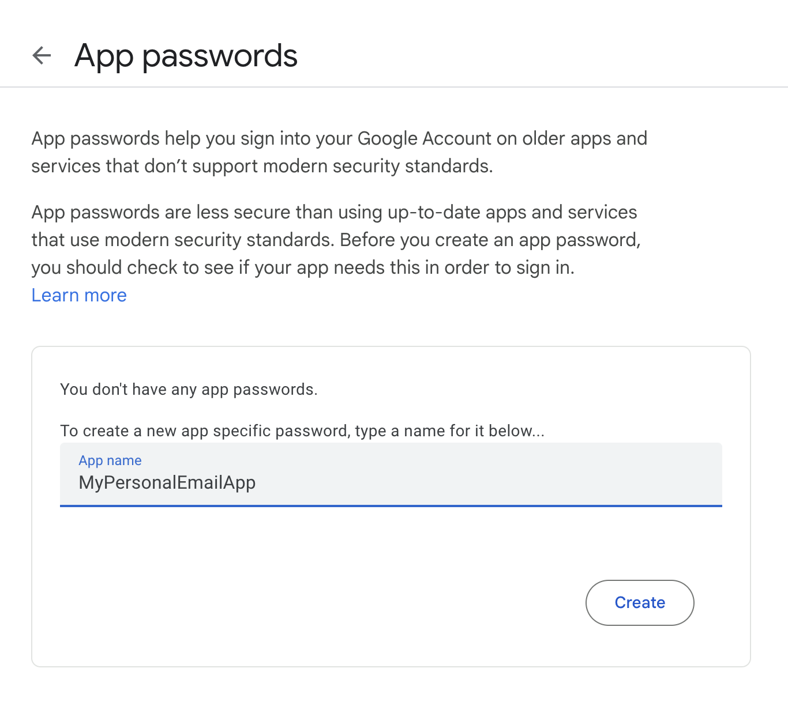

<!-- TOC start (generated with https://github.com/derlin/bitdowntoc) -->

- [Introduction](#introduction)
- [Why Use Gmail SMTP?](#why-use-gmail-smtp)
- [Steps to Set Up Gmail SMTP](#steps-to-set-up-gmail-smtp)
- [Gmail SMTP vs. Gmail API](#gmail-smtp-vs-gmail-api)
- [Conclusion](#conclusion)

<!-- TOC end -->

<!-- TOC --><a href="#" name="introduction"></a>
## Introduction

If you do a lot of hobby projects on the side, specially when its more than a handful, you must have run into situations where you need to be notified when an event occurs. Maybe you have want to be notified when someone submits a form, or a build fails somewhere, or maybe when a trigger event has happened somewhere, and so on.

In many cases, you'll find an existing integration that sends you an email. But as much as we want it, that is not the case all the time.

This little guide will walk you through setting up and using Gmail's SMTP server for sending secure transactional emails for such personal use.

<!-- TOC --><a href="#" name="why-use-gmail-smtp"></a>
## Why Use Gmail SMTP?

Gmail's SMTP server offers several advantages for personal use.

1. **Stability**: Gmail's infrastructure is robust and reliable.
2. **Quick & Easy Setup**: You can set up Gmail SMTP in under 5 minutes.
3. **Reliability for Personal Use**: For individuals and small-scale senders, Gmail's SMTP service is more than sufficient and highly dependable.
4. **Budget Friendly**: Standard Gmail accounts allowws for 500 emails in a 24-hour period, making it an excellent choice for those on a budget.

<!-- TOC --><a href="#" name="steps-to-set-up-gmail-smtp"></a>
## Steps to Set Up Gmail SMTP

Follow these steps to configure your Gmail account for SMTP access:

1. **Access Your Google Account Settings**
   Click on `Manage your Google Account` under your Google account picture. Or, go to the [link here](https://myaccount.google.com)

   

2. **Navigate to the Security Tab**
   Go to the security tab on the opened page. You can also directly [go here](https://myaccount.google.com/security)

3. **Enable 2-Factor Authentication**
   Under `How you sign in to Google` in the security page, enable 2-factor authentication. This is a prerequisite for creating app passwords.

4. **Create an App Password**
   Visit [create a new app password](https://myaccount.google.com/apppasswords) page, and follow steps to create an app password. Save your app password. It will be of the form `abcd efgh ijkl mnop` .

   

   *Why use an app password?* It's more secure than storing your actual Google password in your application or script. This approach reduces the risk if your code is ever compromised.

5. **Use the App Password in Your Code**
   Once you have your app password, you can use it in your code to send emails via Gmail SMTP. Here's an example using `Node.js` and the `nodemailer` library:

```javascript
const { createTransport } = require('nodemailer');

const transporter = createTransport({
    host: "smtp.gmail.com",
    port: 587, // For TLS, use 587, can even use 465 (SSL).
    auth: {
        user: "mypersonal@gmail.com", // Replace with your gmail id 
        pass: "abcd efgh ijkl mnop", // Replace with your app password
    },
});

const mailOptions = {
    from: 'mypersonal@gmail.com',
    to: 'recipient@example.com',
    subject: `Test Subject`,
    text: `This works, yayy!`
};

transporter.sendMail(mailOptions, function(error, info){
    if (error) {
        console.log(error);
    } else {
        console.log('Email sent: ' + info.response);
    }
});
```

<!-- TOC --><a href="#" name="gmail-smtp-vs-gmail-api"></a>
## Gmail SMTP vs. Gmail API

Instead of using Gmail SMTP, you can also use Gmail API to send emails. However, it's much easier to setup Gmail SMTP than setting up the Gmail API. Having said that, Gmail API is definitely more production ready. In fact, if you are looking for production ready SMTP servers, then there are other very stable, secure and reliable solutions like Sendgrid, Resend and the likes.

For basic personal uses, Gmail SMTP, as you have already seen, is a much simpler and quicker setup. 

<!-- TOC --><a href="#" name="conclusion"></a>
## Conclusion

Setting up Gmail SMTP for sending secure transactional emails is a straightforward process that offers a reliable solution for personal use. By following the steps outlined in this article, you can ensure that your important emails are sent securely and efficiently. Remember to keep your app password confidential and never share it with others.

As your email sending needs grow, you may want to consider more robust solutions like dedicated email service providers, However, for most personal needs, Gmail SMTP provides an excellent balance of security, reliability, and ease of use.